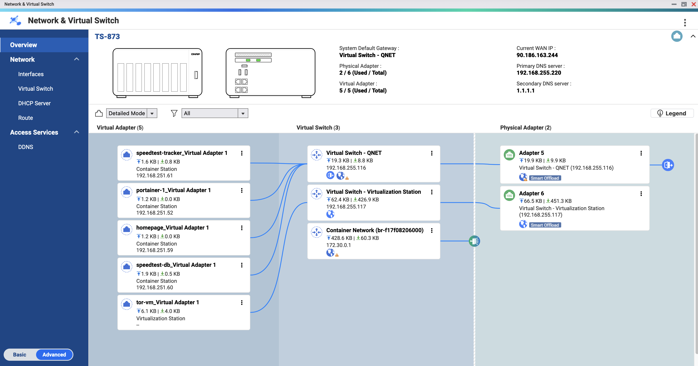
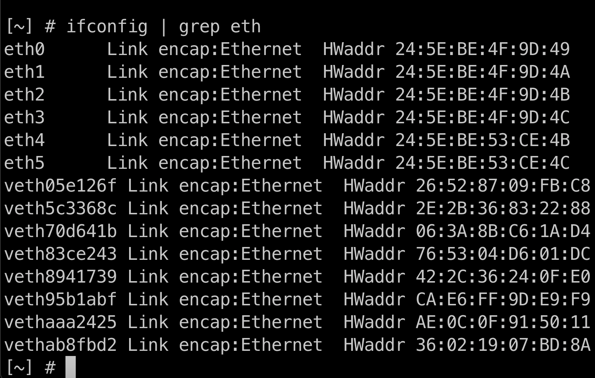

# QNAP network setup 
In my case I have following network setup.



## QNAP network interfaces
In order to specify interface option we need to login to our NAS via SSH and get existing interfaces ID.
Simply run following command
```
ip addr
```
As you see on the screen we have following interfaces available.



Once we have all necessary information we can run next command to create desired network.

# QNAP Network in Docker
In order to create a network with your desired configuration I use following code.

```
docker network create -d qnet --opt=iface=eth4 --ipam-driver=qnet --ipam-opt=iface=eth4 --subnet=192.168.0.0/16 --gateway=192.168.192.1 qnet-static
```
Let me break down what options do we have in network creation:
- Option **-d** - we need to specify qnet as a driver
- Option **--opt=iface=ETH** - we can specify different network interface in QNAP
- Option **--ipam-driver=qnet** - we tell docker to use qnet driver 
- Option **--subnet=192.168.0.0/16** - subnet for our docker network
- Option **--gateway=192.168.192.1** - default gateway in our network
- qnet-static - this is the name of our network. You can use your own name.

QNAP provided as well webpage where they describe network with [docker](https://qnap-dev.github.io/container-station-api/qnet.html).